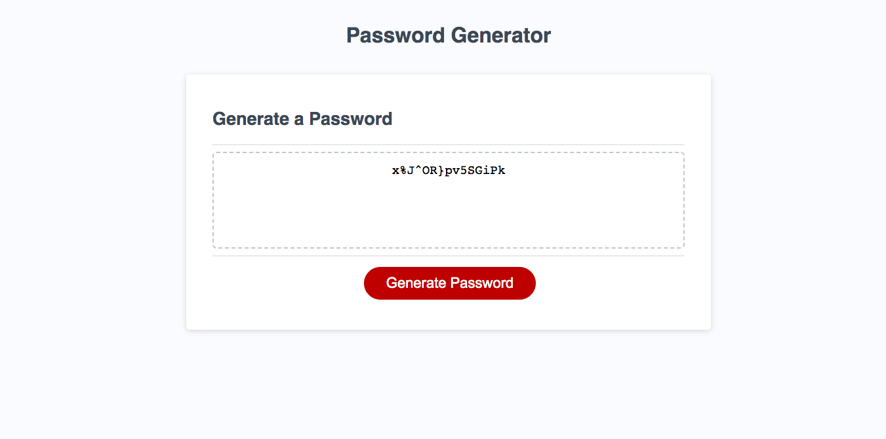

# challenge-3-password-generator

## Description
In this challenge I was given a task to prompt questions that were that going to give me a generated password. When the "Generate Password" button was clicked five questions prompted for the user to answer and confirm. Include what length password?, include lowercase letters?, include uppercase letters?, include numbers?, and include special characters?. I gave a password length requirement of 8 to 128 characters, and if that was not met the user would be prompted an alert message, and be asked the question again. When provided with the users desires for their generated password, I included if statements to validate that the selected criteria would be included in the final result. I made sure to combine all the possible characters that could be included in the generated password. I included the "Math.random" method to randomize the result of the password. Given the writen code, when the user answered and confirmed all the prompted questions, they would be provided with a randomly generated password, and that password would display on the screen.   

## Installation

N/A

## Usage

This challenge provided the user with the ability to generate a password for any of their security desires. This generated password could be used for any of the users password needs.

## Credits

N/A

## License

Please refer to the LICENSE in the repo
